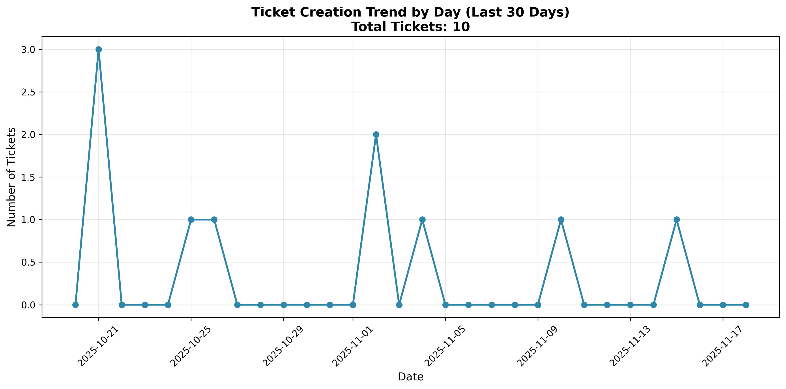
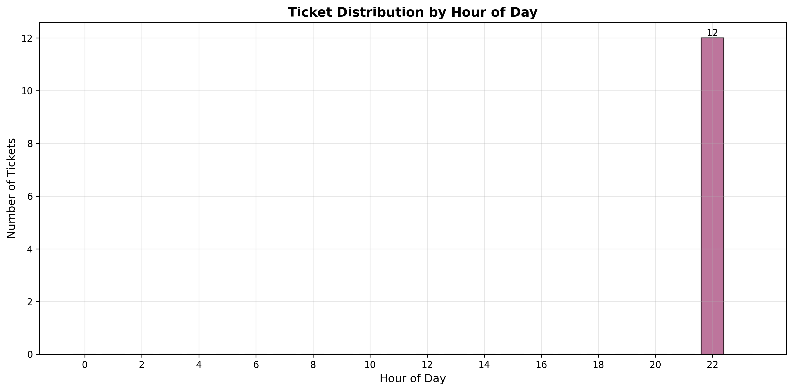
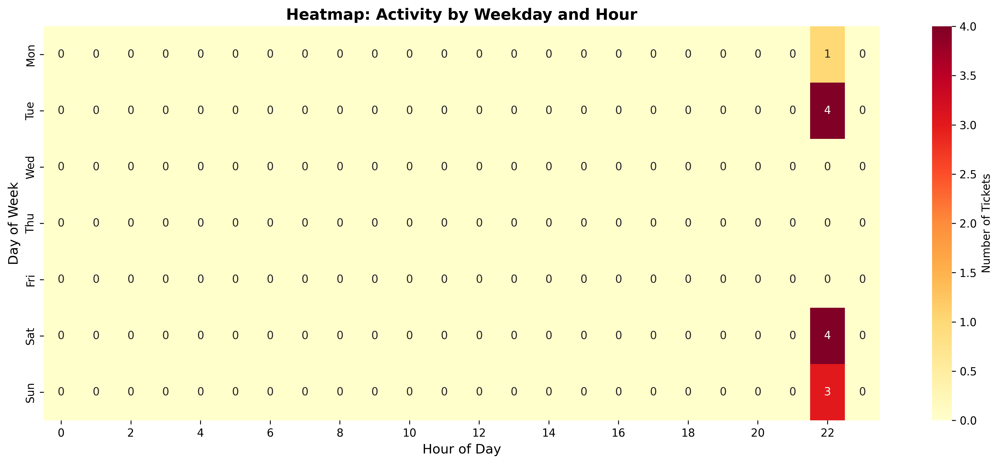
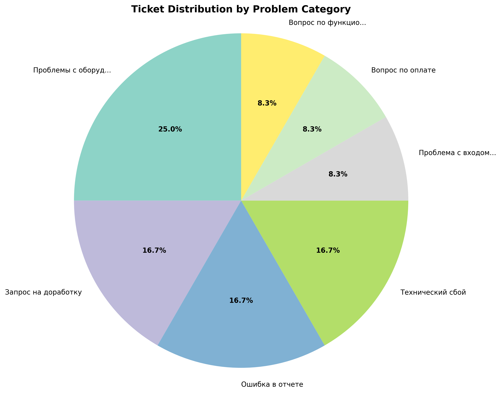
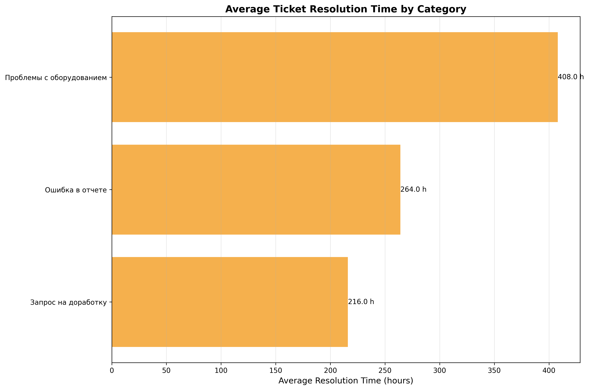

# Аналитическая панель системы технической поддержки

## 1. Общее задание

### Построенные графики:

#### Линейный график: динамика создания тикетов по дням за последние 30 дней


**Рисунок 1 – линейный график**

#### Столбчатая диаграмма: распределение тикетов по часам суток


**Рисунок 2 – столбчатая диаграмма**

#### Тепловая карта: активность по дням недели и часам


**Рисунок 3 – тепловая карта**

## 2. Визуализации – ВАРИАНТ 2
### Отдел системного администрирования

#### Круговая диаграмма: распределение тикетов по категориям проблем


**Рисунок 4 – круговая диаграмма**

#### Горизонтальная столбчатая диаграмма: среднее время решения по категориям


**Рисунок 5 – горизонтальная столбчатая диаграмма**

#### Таблица: топ-5 самых проблемных категорий по количеству тикетов

**Таблица 1 - Топ-5 проблемных категорий**

| Категория | Количество тикетов |
|-----------|-------------------|
| Проблемы с оборудованием | 3 |
| Запрос на доработку | 2 |
| Ошибка в отчете | 2 |
| Технический сбой | 2 |
| Проблема с входом в систему | 1 |

## Результаты выполнения

### Вывод в консоль:
```
Fetching categories using analyst account...
Categories response: <class 'list'>
Fetching tickets for manager_ts
  got 6 tickets for manager_ts
Fetching tickets for manager_sa
  got 6 tickets for manager_sa
Constructed DataFrame with 12 rows
    ticket_id          created_at           closed_at  ... created_weekday created_weekday_name resolution_time
0          33 2025-10-21 22:17:19 2025-11-10 22:17:19  ...               1              Tuesday           480.0
1         112 2025-10-21 22:17:19                 NaT  ...               1              Tuesday             NaN
2         120 2025-11-10 22:17:19 2025-11-15 22:17:19  ...               0               Monday           120.0
3         172 2025-11-02 22:17:19 2025-11-16 22:17:19  ...               6               Sunday           336.0
4         184 2025-10-18 22:17:19                 NaT  ...               5             Saturday             NaN
5         187 2025-10-21 22:17:19                 NaT  ...               1              Tuesday             NaN
6          31 2025-10-25 22:17:19                 NaT  ...               5             Saturday             NaN
7          32 2025-11-15 22:17:19                 NaT  ...               5             Saturday             NaN
8          67 2025-10-26 22:17:19                 NaT  ...               6               Sunday             NaN
9          90 2025-11-04 22:17:19 2025-11-15 22:17:19  ...               1              Tuesday           264.0
10        148 2025-11-02 22:17:19 2025-11-15 22:17:19  ...               6               Sunday           312.0
11        155 2025-10-18 22:17:19                 NaT  ...               5             Saturday             NaN

[12 rows x 13 columns]
Saved output\line_daily_tickets.png
Saved output\bar_hourly_distribution.png
Saved output\heatmap_weekday_hour.png
Saved output\pie_by_category.png
Saved output\avg_resolution_by_category.png
Saved output\top5_categories.csv

Top-5 categories by ticket count:
category
Проблемы с оборудованием       3
Запрос на доработку            2
Ошибка в отчете                2
Технический сбой               2
Проблема с входом в систему    1
Name: count, dtype: int64

============================================================
DETAILED STATISTICS
============================================================
Total tickets: 12
Data period: from 2025-10-18 to 2025-11-15
Unique categories: 7

Status distribution:
Average resolution time: 302.4 hours
Closed tickets: 5

All charts saved to folder: output 20:55:09,117 - downtime_analyzer - INFO - Printing downtime analysis results
```
